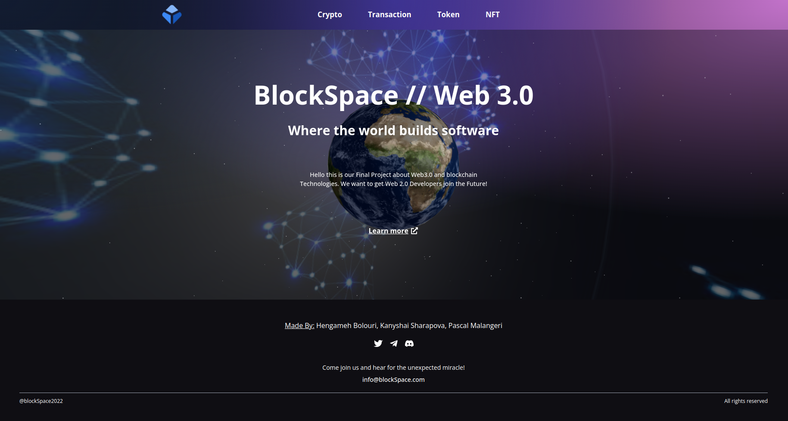

# Krypt - Web 3.0 Blockchain Application

## Introduction
This is our Final Project ...

In this Project we used web 3.0 methodologies, Solidity and Metamask.

Project created in collaboration with Hengameh Bolouri and Pascal Malangeri.

### Git-steps
you have make sure you in the dev branch
1) git pull origin dev (get data from the github)
2) git checkout -b 'name-feature' 
3) git add .
4) git commit -m ''
5) git push origin 'branch name'
6) on github create pull request from your branch to dev branch
7) for next feature you have to these steps again

